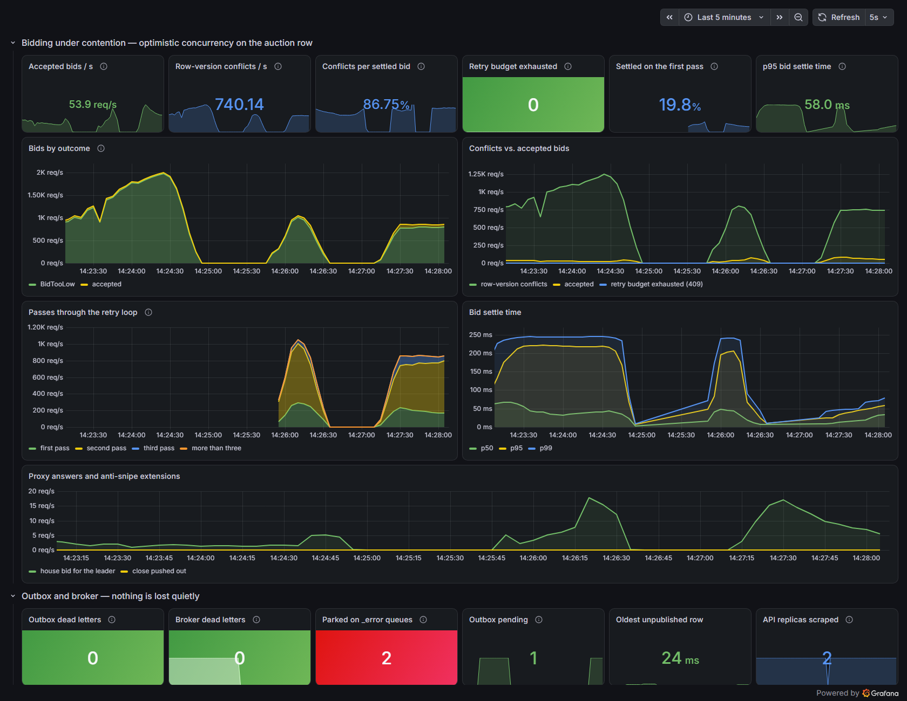
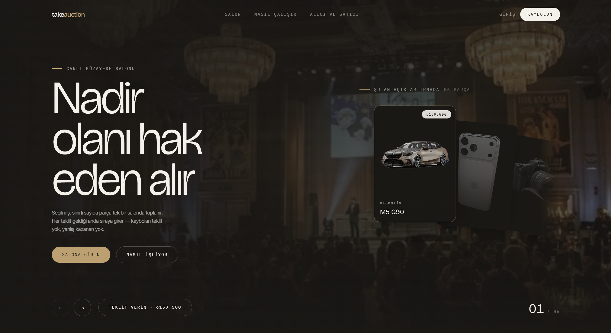
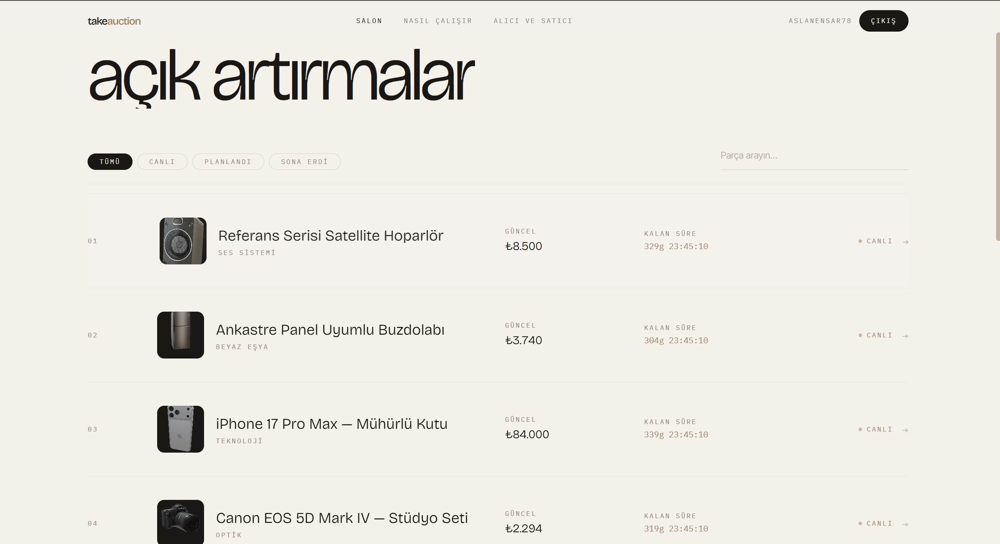
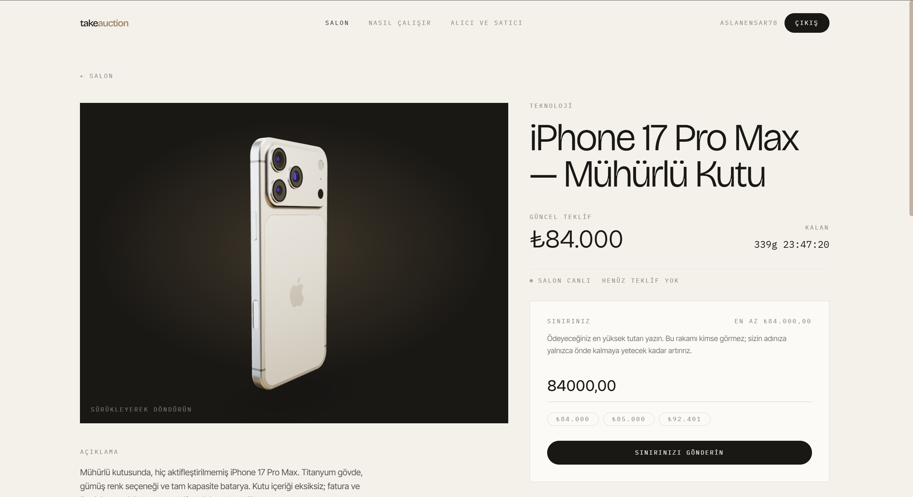

# 🔨 TakeAuction

[🇹🇷 Türkçe](README.md) | [🇬🇧 English](README.en.md)

[](https://github.com/EnsarAslannn/TakeAuction/actions/workflows/ci.yml)

.NET tabanlı, Vertical Slice Architecture ile geliştirilmiş, yüksek trafikli ve eşzamanlı
canlı açık artırma sistemi. Teklifler outbox tabanlı bir olay hattından geçerek yayınlanır,
lotlar ise zamanı geldiğinde kendi kendine kapanır.

**🔗 Canlı demo:** [take-auction.vercel.app](https://take-auction.vercel.app)

## 📌 Proje Hakkında

TakeAuction, satıcıların lot listelediği, alıcıların gizli (sealed) proxy tekliflerle
yarıştığı ve her kapanışın bir insanın ekranı izlemesi yerine saatin kendisi tarafından
tetiklendiği gerçek zamanlı bir açık artırma platformudur.

Bir teklif ve onu duyuran olay aynı veritabanı transaction'ında yazılır; böylece sistemin
"teklif var ama kimseye haber verilmedi" durumuna düşmesi mümkün değildir. Arka planda
çalışan bir dispatcher bu olayları RabbitMQ'ya taşır — canlı bir teklife anında tepki
verir, aynı zamanda periyodik olarak da tarar; böylece bir broker kesintisi ya da ölü bir
instance yüzünden hiçbir mesaj kaybolmaz.

Amaç sadece "teklif ver" butonu olan bir CRUD uygulaması değil; gerçek rekabet altında
concurrency'yi, teslimat garantilerini ve kapanış mantığını doğru şekilde ele alan, bunu
kanıtlayacak metriklerle desteklenen uçtan uca bir sistem ortaya koymaktır.

## ⚙️ Öne Çıkan Özellikler

### 🔨 Proxy Teklif Sistemi

- Bir teklif fiyat değil, gizli bir tavandır — sistem alıcı adına yalnızca liderliği almak
  için gereken kadar teklif verir
- Kazanan, harcamaya razı olduğu her şeyi değil, bir sonraki en yüksek tavanın üzerine
  sadece bir artış payı öder
- Liderin tavanını geçemeyen bir rakip otomatik olarak yanıtlanır; eşitlikte mevcut lider
  kazanır
- Tavan alanı (`MaxAmount`) hiçbir yanıtta taşınmaz — ne detay endpoint'inde, ne teklif
  geçmişinde, ne de hub üzerinden; bir alıcı yalnızca kendi tavanını geri okur
- Kamuya açık olan tek şey oluşan fiyattır. Bir düello bir artış payı içinde
  sonuçlandığında bu fiyat, yenilen tavanın tam üstüne oturabilir — eBay'de olduğu gibi:
  gizli kalan, kazananın nereye kadar gitmeye razı olduğudur

### 📡 Transactional Outbox → RabbitMQ

- Teklif satırı ve `outbox_messages` satırı aynı transaction içinde commit edilir;
  veritabanı ile olay akışı asla birbirinden farklı bir hikaye anlatmaz
- Dispatcher commit anında uyanır (milisaniyeler içinde teslimat), ayrıca zamanlayıcıyla
  da tarar
- Kilitler `FOR UPDATE SKIP LOCKED` ile alınır; birden fazla API instance'ı aynı mesajı
  asla iki kez göndermez
- Teslimat "en az bir kez" prensibiyle çalışır — tüketicilerin tekrar eden mesajlara
  tolerans göstermesi beklenir

### ⏱️ Kendi Kendine Kapanan, Snipe'a Dayanıklı Lotlar

- Her lot, kapanması gereken saniye için kendi kapanışını önceden planlar; bir sonraki
  taramayı beklemez
- Periyodik tarama, kaybolan planlamalar için güvenlik ağı olarak kalır
- Kapanış idempotent'tir; iki tetikleyiciden hangisi ikinci sırada gelirse gelsin lotu
  zaten kapanmış bulur
- Kapanış penceresi içine gelen bir teklif, bitiş saatini eski bitiş saatine değil
  teklifin kendisine göre ileri iter; böylece her snipe aynı yanıt süresini alır, üst
  üste birikmez

### 🔔 Bildirim Kutusu ve Takip Listesi

- Bir lot kapandığında kazanana "parça sizin", satıcıya "satıldı" ya da "teklif gelmedi"
  bildirimi gider. Bildirim önce kalıcı bir kutuya yazılır, sonra SignalR ile yalnızca
  alıcısına itilir; kapanış anında sitede olmayan kullanıcı da girişte görür
- Teslimat "en az bir kez" çalıştığı için kutu idempotent'tir: `(kullanıcı, tür, lot)`
  üzerindeki unique index, tekrar teslim edilen bir mesajın ikinci satır açmasını ve ikinci
  kez itilmesini engeller
- Alıcılar bir lotu takibe alabilir; lot son beş dakikasına girdiğinde haber verilir.
  Hatırlatma job'ı vadesi gelen takipleri tek bir `UPDATE … RETURNING` ile,
  `FOR UPDATE SKIP LOCKED` üzerinden sahiplenir ve hatırlatma olayını aynı transaction
  içinde outbox'a yazar; aynı anda çalışan iki tarama bile bir takibi iki kez hatırlatmaz

### 🩺 Sağlık ve Operasyon Uçları

- `/health/live` — sürecin ayakta olup olmadığını kontrol eder, hiçbir dış bağımlılığa
  bakmaz
- `/health/ready` — PostgreSQL, Redis ve RabbitMQ'nun erişilebilir olduğunu doğrular
- `/metrics` — Prometheus scraping endpoint'i, yalnızca iç ağdan erişilebilir (gateway bu
  path için 404 döner)

### 📊 Gözlemlenebilirlik (Observability)

- İstek sayıları ve gecikmeler ASP.NET Core enstrümantasyonundan hazır gelir
- Sistemin gerçekten değerlendirildiği metrikler ayrıca ölçülür: concurrency çakışmaları
  (`takeauction.bids.concurrency_conflicts`), bir teklifin kaç retry'da sonuçlandığı
  (`takeauction.bids.attempts`), uçtan uca teklif süresi (`takeauction.bids.duration`),
  proxy'nin lider adına kaç kez yanıt verdiği, kapanışın kaç kez ertelendiği ve outbox'ın
  yetişip yetişmediği (`takeauction.outbox.batch_size`)
- Hiçbir mesaj sessizce kaybolmaz: retry'larını tüketip `_error` kuyruğuna düşen her mesaj
  sayılır (`takeauction.messaging.dead_letters`), `MaxAttempts`'i tüketmiş outbox satırları
  ve en eski yayımlanmamış satırın yaşı gauge olarak yayınlanır
- `docker compose --profile observability up` ile Prometheus ve hazır bir Grafana paneli
  gelir; Prometheus API replikalarını Docker DNS üzerinden kendisi bulur ve dead letter,
  outbox birikmesi ve tükenen retry bütçesi için alarm kuralları tanımlıdır
- `Telemetry__OtlpEndpoint` ile trace ve metrikler bir OTLP collector'a gönderilir

### 🔐 Secrets & Konfigürasyon

- `Jwt:SigningKey` Development dışında hiçbir varsayılana sahip değildir; API bu değer
  verilmeden başlamayı reddeder — `Jwt__SigningKey`, user secrets ya da platformun secret
  store'u üzerinden sağlanmalıdır
- Bağlantı string'leri de aynı kurala tabidir: localhost değerleri yalnızca
  `appsettings.Development.json` içinde yaşar; başka her yerde açıkça verilmesi gerekir,
  aksi halde sessizce localhost'a bağlanmak yerine sistem yüksek sesle hata verir

## 🏗️ Proje Mimarisi

API, yatay katmanlar yerine Vertical Slice olarak organize edilmiştir:

```
src/TakeAuction.Api/Features → Auctions, Auth, Media — her slice kendi request,
                                handler ve validasyonunu uçtan uca kendisi taşır
Outbox + dispatcher            → veritabanı ile RabbitMQ'nun asla çelişmemesini garanti eder
Hangfire                       → lot bazlı kapanış planlaması ve periyodik tarama
```

Her şeyin önünde bir nginx gateway durur: `/api`, `/hubs` ve `/uploads` isteklerini
API'ye, geri kalan her şeyi SPA'ya yönlendirir; böylece tarayıcı tek bir origin ile
konuşur. Gateway ayrıca ilk savunma hattıdır: `/api` için saniyede 20, giriş ve kayıt
uçları için saniyede 1 istek sınırı uygular, hub bağlantılarını IP başına 20 ile
sınırlar. Uygulama katmanındaki limitler bunun arkasında ikinci kez çalışır.

Frontend, backend'den bağımsız ayrı bir React + TypeScript projesi olarak geliştirilmiştir
(`src/TakeAuction.Web`) ve API ile REST ve SignalR üzerinden konuşur.

## 🛠️ Kullanılan Teknolojiler

**Backend**

- .NET 10, ASP.NET Core Web API
- PostgreSQL (Entity Framework Core / Npgsql)
- Redis
- RabbitMQ (MassTransit)
- Hangfire
- MediatR, FluentValidation, Serilog, OpenTelemetry
- JWT tabanlı kimlik doğrulama

**Frontend**

- React 18 + TypeScript
- Vite
- Tailwind CSS
- Zustand, Axios, React Router
- React Three Fiber / drei, GSAP, Lenis

**Test**

- xUnit, NSubstitute
- Testcontainers (Postgres, Redis & RabbitMQ ile gerçek entegrasyon testleri)
- Playwright (uçtan uca testler)

**Dağıtım**

- API + PostgreSQL + Redis: Docker ile Railway üzerinde
- Frontend: Vercel üzerinde
- nginx gateway: Docker Compose

## 🚀 Kurulum

### Gereksinimler

- [.NET 10 SDK](https://dotnet.microsoft.com/download)
- [Node.js](https://nodejs.org/) 22+
- Docker (Postgres, Redis ve RabbitMQ için)

### Her şeyi container'la çalıştırma

```bash
docker compose up --detach --wait # http://localhost:8080
```

Gateway `/api`, `/hubs` ve `/uploads` isteklerini API'ye, geri kalanını SPA'ya
yönlendirir. API, başlangıçta kendi migration'larını uygular ve verilerini seed eder.

API yatay olarak ölçeklenebilir — outbox `FOR UPDATE SKIP LOCKED` ile çalışır, SignalR
Redis backplane üzerinden yayın yapar ve Hangfire süpürmeleri `DisableConcurrentExecution`
ile korunur:

```bash
docker compose up --detach --wait --scale api=3
```

nginx, upstream'deki `api` adını açılışta çözer ve dönen her replika adresini havuza
ekler; bu yüzden ölçeği gateway ayağa kalkmadan önce vermek gerekir.

Her replika en fazla `POSTGRES_POOL_SIZE` (varsayılan 30) bağlantı açar. Replika sayısı
çarpı bu değer, PostgreSQL'in `max_connections` sınırının (100) altında kalmalıdır; aksi
halde yük altında `too many clients` hatası alınır.

### Gözlemlenebilirlik paneli

```bash
docker compose --profile observability up --detach --wait
# Grafana: http://localhost:3000   Prometheus: http://localhost:9090
```

Panel anlamlı veriyi yük altında gösterir; [yük testi](tests/TakeAuction.LoadTests/README.md)
tek bir lota yüzlerce eşzamanlı teklif gönderir:

<p align="center">

</p>

İki replika ve 150 sanal kullanıcıyla: saniyede ~740 satır sürümü çakışması yaşanıyor ve
retry döngüsü her birini emiyor. Tekliflerin yaklaşık beşte biri ilk denemede sonuçlanıyor,
geri kalanı ikinci ya da üçüncü turda. Hiçbir teklif sahibi "tekrar deneyin" (409) yanıtı
almıyor.

### Geliştirme için çalıştırma

```bash
docker compose up --detach --wait postgres redis rabbitmq

dotnet run --project src/TakeAuction.Api # http://localhost:5080
npm --prefix src/TakeAuction.Web run dev # http://localhost:5173
```

### Testler

```bash
dotnet test # unit, integration ve API contract testleri
npm --prefix tests/TakeAuction.E2E test # Playwright, bkz. tests/TakeAuction.E2E/README.md
```

> Entegrasyon ve API testleri kendi PostgreSQL, Redis ve RabbitMQ'larını Testcontainers
> ile ayağa kaldırır — Docker'ın çalışıyor olması yeterlidir, önceden hiçbir şeyin ayakta
> olması gerekmez.

### Dağıtım

SPA Vercel'e, API ve onun Postgres/Redis'i Railway'e dağıtılır. Adım adım
[docs/DEPLOYMENT.md](docs/DEPLOYMENT.md) içinde.

## 📸 Proje Görselleri

**Ana Sayfa**

<p align="center">


</p>

**Açık Artırmalar**

<p align="center">

</p>

**Açık Artırma Detayı**

<p align="center">

</p>

## 📄 Lisans

MIT — bkz. [LICENSE](./LICENSE).
